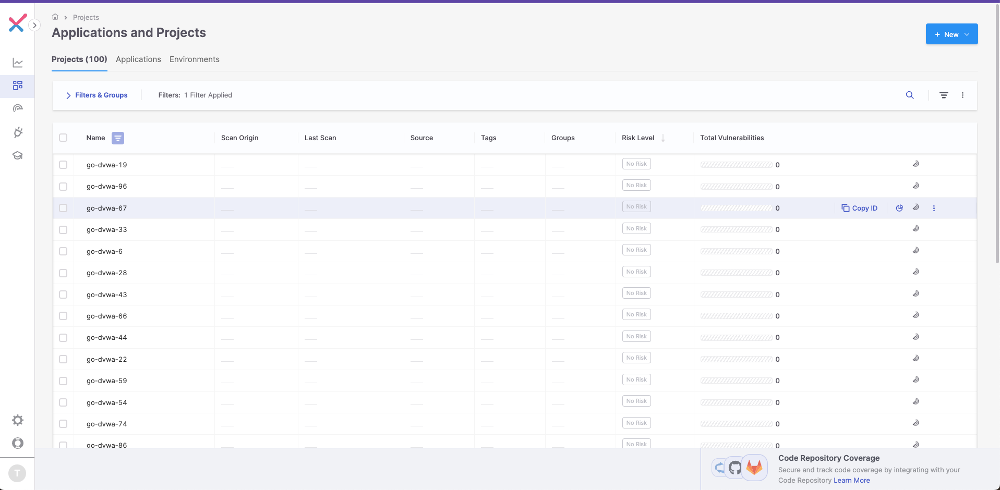

# sast_stress_poc

```bash
brew install xmlstarlet
```

## Veracode


```bash
bash bin/veracode/veracode_install.sh
```


## Checkmarx

```bash
brew install checkmarx/ast-cli/ast-cli
```


https://github.com/checkmarx/ast-cli
https://github.com/Checkmarx/homebrew-ast-cli 


# How to use 

```bash
./sast_stress.sh -t veracode -p ProjectName -s ../VulnNode -n 100
```


```bash
./sast_stress.sh -t checkmarx -p ProjectName -s ../VulnNode -n 100
```
